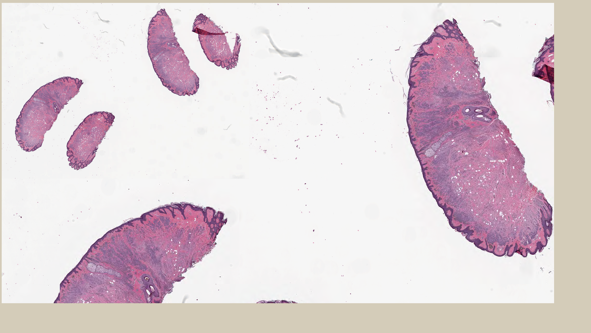
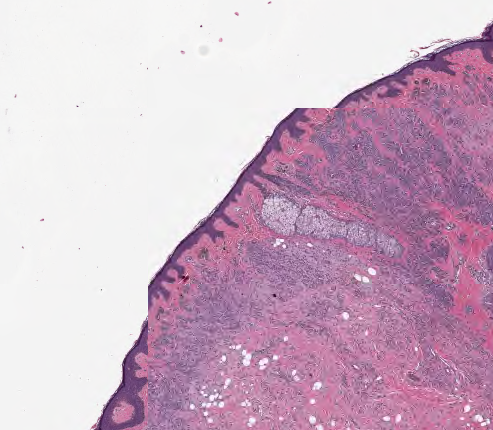

# wsi-tv

Whole slide image terminal viewer. Made for [kitty](https://sw.kovidgoyal.net/kitty/) terminal.

Uses custom base64 encoder that takes `RGBA` as input and encodes to base64 `RGB`.



## Installation

```bash
make
```

## Usage

```bash
./wsi-tv <slidepath>
```

## Keys

- `q` - quit
- `t` - toggle thumbnail

- `j` / `↓` - down
- `k` / `↑` - up
- `l` / `←` - right
- `h` / `→` - left
- `i` - zoom in ( keeps top left constant )
- `o` - zoom out ( keeps top left constant )

- `1`, `2`, ... - jump to level - not yet implemented

## Limitations

- Needs terminal support for [kitty image protocol](https://sw.kovidgoyal.net/kitty/graphics-protocol/).
- Terminal needs to respond to `\x1b[14t` request for pixel dimensions.
- Only tested on Linux.

## Issues

- Tile positions are not always correct.
  - 
- If it crashes, kitty needs to be reset.
  - use `reset`
- Not optimal base64
  - Use [race64](https://github.com/skeeto/race64) for base64 encoding ( with SIMD optimizations ).
- No caching strategy, always loads new tiles in view.

## Program structure


## Optimization

```
Each sample counts as 0.01 seconds.
  %   cumulative   self              self     total
 time   seconds   seconds    calls  ms/call  ms/call  name
100.12      0.14     0.14      312     0.45     0.45  base64_encode
  0.00      0.14     0.00     1396     0.00     0.00  bufferDisplayImage
  0.00      0.14     0.00     1396     0.00     0.00  moveCursor
  0.00      0.14     0.00     1395     0.00     0.00  bufferClearImage
  0.00      0.14     0.00      312     0.00     0.45  bufferProvisionImage
  0.00      0.14     0.00      311     0.00     0.00  bufferLoadImage
  0.00      0.14     0.00       93     0.00     0.00  abAppend
  0.00      0.14     0.00       44     0.00     0.00  getKeypress
  0.00      0.14     0.00       31     0.00     0.00  abFree
  0.00      0.14     0.00       31     0.00     0.00  viewerRender
  0.00      0.14     0.00       13     0.00     2.25  viewerMoveRight
  0.00      0.14     0.00        9     0.00     4.04  viewerMoveDown
  0.00      0.14     0.00        6     0.00     2.25  viewerMoveLeft
  0.00      0.14     0.00        2     0.00    20.22  viewerZoomIn
  0.00      0.14     0.00        1     0.00     0.00  bufferInit
  0.00      0.14     0.00        1     0.00     0.00  getWindowSize
  0.00      0.14     0.00        1     0.00     0.00  slideInit
```

```
Each sample counts as 0.01 seconds.
  %   cumulative   self              self     total
 time   seconds   seconds    calls  ms/call  ms/call  name
100.12      0.02     0.02      288     0.07     0.07  bufferProvisionImage
  0.00      0.02     0.00      662     0.00     0.00  moveCursor
  0.00      0.02     0.00      661     0.00     0.00  bufferDisplayImage
  0.00      0.02     0.00      660     0.00     0.00  bufferClearImage
  0.00      0.02     0.00      287     0.00     0.00  bufferLoadImage
  0.00      0.02     0.00       99     0.00     0.00  abAppend
  0.00      0.02     0.00       49     0.00     0.00  getKeypress
  0.00      0.02     0.00       33     0.00     0.00  abFree
  0.00      0.02     0.00       33     0.00     0.00  viewerRender
  0.00      0.02     0.00       11     0.00     0.28  viewerMoveDown
  0.00      0.02     0.00        9     0.00     0.35  viewerMoveRight
  0.00      0.02     0.00        8     0.00     1.39  viewerZoomIn
  0.00      0.02     0.00        2     0.00     0.35  viewerMoveLeft
  0.00      0.02     0.00        2     0.00     0.28  viewerMoveUp
  0.00      0.02     0.00        1     0.00     0.00  bufferInit
  0.00      0.02     0.00        1     0.00     0.00  getWindowSize
  0.00      0.02     0.00        1     0.00     0.00  slideInit
```

## Caching

- With tile size of 256 pixels
  - each tile requires
  - $256 (width) * 256 (height) * 4 (rgba) \ 2 (buf,buf64) = 0.5MB$
- Assuming screen size of ~3k x ~2k, with 4 tiles to 1k,
  - we get approx 12 cols x 8 rows = 96
- Therefore, total mem for 1 full screen,
  - $96 \ 0.5 = 48MB$
- Kitty max is 320MB

  - ~6 screens = $96 * 6 = 576$ tiles
  - [quota](https://sw.kovidgoyal.net/kitty/graphics-protocol/#image-persistence-and-storage-quotas).

- Therefore, viable strategy:
  - assume screen is 12 cols \* 8 rows
  - maintain 3 levels
  - set `border` to 2 tiles
  - details:
    - base everything on distance from center.
    - compute updated distances on keypress
    - determine which buffers to replace based on sorted distances
