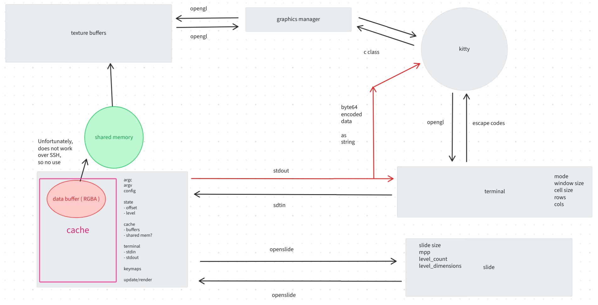

# ssh-wsi

SSH server to serve whole slide images. Made for kitty terminal.

## Installation

```bash
make
```

## Usage

```bash
./wsi-tv <slidepath>
```

## Keys

- `q` - quit
- `j` - down
- `k` - up
- `l` - right
- `h` - left
- `i` - zoom in
- `o` - zoom out
- `1`, `2`, ... - jump to level

## Limitations

- Needs terminal support for `ws_pixel_x` and `ws_pixel_y` with
  `ioctl` request to find terminal width and height in pixels.
- Needs terminal support for [kitty image protocol](https://sw.kovidgoyal.net/kitty/graphics-protocol/).

## Program structure



## Optimization

```
Each sample counts as 0.01 seconds.
  %   cumulative   self              self     total           
 time   seconds   seconds    calls  ms/call  ms/call  name    
100.12      0.14     0.14      312     0.45     0.45  base64_encode
  0.00      0.14     0.00     1396     0.00     0.00  bufferDisplayImage
  0.00      0.14     0.00     1396     0.00     0.00  moveCursor
  0.00      0.14     0.00     1395     0.00     0.00  bufferClearImage
  0.00      0.14     0.00      312     0.00     0.45  bufferProvisionImage
  0.00      0.14     0.00      311     0.00     0.00  bufferLoadImage
  0.00      0.14     0.00       93     0.00     0.00  abAppend
  0.00      0.14     0.00       44     0.00     0.00  getKeypress
  0.00      0.14     0.00       31     0.00     0.00  abFree
  0.00      0.14     0.00       31     0.00     0.00  viewerRender
  0.00      0.14     0.00       13     0.00     2.25  viewerMoveRight
  0.00      0.14     0.00        9     0.00     4.04  viewerMoveDown
  0.00      0.14     0.00        6     0.00     2.25  viewerMoveLeft
  0.00      0.14     0.00        2     0.00    20.22  viewerZoomIn
  0.00      0.14     0.00        1     0.00     0.00  bufferInit
  0.00      0.14     0.00        1     0.00     0.00  getWindowSize
  0.00      0.14     0.00        1     0.00     0.00  slideInit
```

```
Each sample counts as 0.01 seconds.
  %   cumulative   self              self     total           
 time   seconds   seconds    calls  ms/call  ms/call  name    
100.12      0.02     0.02      288     0.07     0.07  bufferProvisionImage
  0.00      0.02     0.00      662     0.00     0.00  moveCursor
  0.00      0.02     0.00      661     0.00     0.00  bufferDisplayImage
  0.00      0.02     0.00      660     0.00     0.00  bufferClearImage
  0.00      0.02     0.00      287     0.00     0.00  bufferLoadImage
  0.00      0.02     0.00       99     0.00     0.00  abAppend
  0.00      0.02     0.00       49     0.00     0.00  getKeypress
  0.00      0.02     0.00       33     0.00     0.00  abFree
  0.00      0.02     0.00       33     0.00     0.00  viewerRender
  0.00      0.02     0.00       11     0.00     0.28  viewerMoveDown
  0.00      0.02     0.00        9     0.00     0.35  viewerMoveRight
  0.00      0.02     0.00        8     0.00     1.39  viewerZoomIn
  0.00      0.02     0.00        2     0.00     0.35  viewerMoveLeft
  0.00      0.02     0.00        2     0.00     0.28  viewerMoveUp
  0.00      0.02     0.00        1     0.00     0.00  bufferInit
  0.00      0.02     0.00        1     0.00     0.00  getWindowSize
  0.00      0.02     0.00        1     0.00     0.00  slideInit
```
